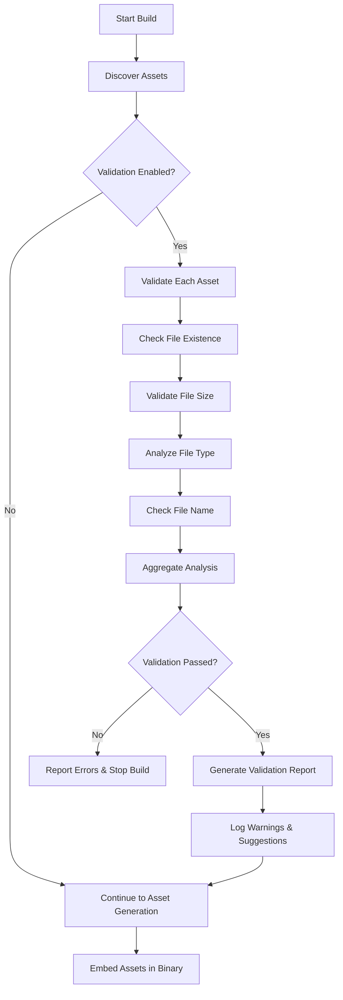

# Asset Validation in SvelteKit Exec Adapter

## Overview

The **Asset Validation** feature in SvelteKit Exec Adapter provides comprehensive validation of all static assets before they are embedded into the binary executable. This ensures build reliability, prevents common deployment issues, and helps optimize binary size.

## Why Asset Validation?

### The Problem: Developers Have Control, But Issues Still Happen

You might wonder: **"If developers control their projects, why do we need asset validation?"**

While developers do have full control over their projects, asset validation serves as a crucial safety net for several reasons:

#### 1. **Preventing Silent Failures**

```javascript
// This might work in development but fail in production
import logo from "./assets/logo.png"; // File exists locally
// But what if the file gets deleted, moved, or corrupted during CI/CD?
```

Common scenarios where things go wrong:

- Files get corrupted during git operations
- Case sensitivity issues (works on Windows, fails on Linux)
- Files exist in development but missing in CI/CD environments
- Symlinks break when code is deployed to different environments

#### 2. **Binary Size Reality Check**

```javascript
// Developer adds large files without realizing the impact
static / demo - video.mp4; // 100MB - will create 100MB+ binary!
presentation.pptx; // 50MB - embedded in executable
backup - data.zip; // 200MB - accidental inclusion
```

Developers often forget that **every static file becomes part of the executable**:

- Accidentally embedding huge files (databases, videos, archives)
- Creating multi-gigabyte binaries that are impractical to distribute
- Including temporary/backup files that inflate size
- Gradual size creep over time without noticing

#### 3. **Security & Platform Safety**

```javascript
// Dangerous files that could cause issues
static / helper.exe; // Executable - security risk
install.msi; // Windows installer - won't work on Linux
library.dll.DS_Store; // Windows-specific - breaks cross-platform // macOS system file - unnecessary bloat
```

Even experienced developers might accidentally:

- Commit system files (`.DS_Store`, `thumbs.db`)
- Include platform-specific binaries that break cross-compilation
- Add executable files that create security concerns
- Leave temporary files that shouldn't be distributed

#### 4. **Build Environment Differences**

```bash
# Works locally (file exists)
npm run dev ✅

# Fails in CI (file missing, different case, or permission issues)
npm run build ❌
# Error: Cannot read file './Static/Logo.PNG' (note the case difference)
```

Common environment issues:

- **Case sensitivity**: `Logo.PNG` vs `logo.png` - works on Windows, fails on Linux
- **Permission issues**: Files readable locally but not in Docker containers
- **Missing dependencies**: Files exist locally but missing in clean build environments
- **Path differences**: Absolute vs relative path issues across platforms

#### 5. **Team Development Challenges**

```javascript
// Developer A adds large assets
static/
  high-res-images/     // 200MB of unoptimized images

// Developer B doesn't notice and builds
npm run build
// Creates 300MB binary - too large for deployment!
```

In team environments:

- Different developers have varying awareness of binary size implications
- Large assets get added incrementally over time
- No single person sees the full picture until build time
- Knowledge gaps about what gets embedded vs served externally

#### 6. **Deployment & Distribution Reality**

```bash
# Local development - fast builds
npm run build  # 2 minutes, 50MB binary ✅

# Production - slow builds, huge binaries
npm run build  # 15 minutes, 500MB binary ❌
# Binary too large for:
# - GitHub releases (100MB limit)
# - Docker registries (layer size limits)
# - CDN distribution (bandwidth costs)
# - Email attachments (if distributing to clients)
```

#### 7. **Framework-Specific Gotchas**

```javascript
// SvelteKit specifics that developers might not consider
src/
  lib/
    large-dataset.json    // Will be bundled into binary
static/
  _app/                   // Old build artifacts might remain
  node_modules/           // Accidentally copied to static
```

SvelteKit developers might not realize:

- What gets included in the final bundle vs what's served separately
- How static assets are processed differently than component assets
- The cumulative impact of their asset choices on the final executable

### Asset Validation as a Safety Net

Think of asset validation like other development tools:

- **TypeScript** - You could write JavaScript, but types catch errors
- **Linting** - You could format manually, but linters catch issues
- **Testing** - You could test manually, but automated tests catch regressions

Asset validation catches issues that developers **could** avoid but often **don't** because:

- They're focused on features, not build optimization
- They don't realize the implications of their choices
- They work in different environments than production
- They don't see the cumulative effect of team changes

### Real-World Impact Scenarios

#### **Scenario 1: Accidental Large File**

```bash
# Developer saves a database backup in static/
static/backup.sql  # 2GB file

npm run build
# Result: 2GB+ executable that's impossible to distribute
```

#### **Scenario 2: System File Contamination**

```bash
# macOS developer commits system files
static/.DS_Store
static/Icon^M

# Linux CI build includes these unnecessary files
# Windows users get confused by unknown files
```

#### **Scenario 3: Gradual Size Creep**

```bash
Week 1: 10MB binary    ✅ Great!
Week 3: 50MB binary    ✅ Still okay
Week 6: 150MB binary   ⚠️  Getting large...
Week 8: 400MB binary   ❌ Too big for deployment!
```

### When Asset-Related Issues Actually Cause Problems

- **Build Failures**: Invalid or corrupted files can break the compilation process
- **Runtime Errors**: Missing or inaccessible assets cause 404 errors
- **Performance Issues**: Oversized assets create bloated binaries and slow startup times
- **Security Risks**: Embedding executable files or malicious content
- **Cross-Platform Issues**: Platform-specific files causing compatibility problems
- **Distribution Problems**: Binaries too large for deployment platforms
- **Cost Issues**: Bandwidth and storage costs for oversized binaries

### Configurable by Design

The validation system is designed to be **helpful, not restrictive**:

```javascript
// For experienced teams who know what they're doing
adapter({
  validation: {
    skip: true, // "I know what I'm doing, skip validation"
  },
});

// For most teams - reasonable defaults with customization
adapter({
  validation: {
    maxAssetSize: 100 * 1024 * 1024, // "Our images can be up to 100MB"
    allowedExtensions: [".exe"], // "We intentionally include executables"
    warnThreshold: 50 * 1024 * 1024, // "Warn me at 50MB, not 10MB"
  },
});
```

Asset validation catches these issues **early** in the build process, providing clear feedback and actionable solutions.

## How It Works

### 1. **Asset Discovery Phase**

The validator scans two primary directories:

- **Client Assets** (`/client`): JavaScript, CSS, images, fonts, etc.
- **Prerendered Assets** (`/prerendered`): Static HTML files and cached content

```typescript
// Discovery process
const clientAssets = await discoverClientAssets(
  join(SVELTEKIT_DIR, "client"),
  join(SVELTEKIT_DIR, "prerendered")
);
```

### 2. **Individual Asset Validation**

Each asset undergoes multiple validation checks:

#### **File Existence & Accessibility**

```typescript
// Checks if file exists and is readable
if (!(await fileExists(asset.filePath))) {
  errors.push(`Asset file not found: ${asset.filePath}`);
}
```

#### **File Size Validation**

```typescript
// Size limits to prevent bloated binaries
if (stats.size > options.maxAssetSize) {
  errors.push(
    `Asset too large: ${asset.routePath} (${formatBytes(stats.size)})`
  );
} else if (stats.size > options.warnThreshold) {
  warnings.push(
    `Large asset detected: ${asset.routePath} (${formatBytes(stats.size)})`
  );
}
```

#### **File Type Analysis**

```typescript
// Security and compatibility checks
if (options.blockedExtensions.includes(ext)) {
  errors.push(`Blocked file type: ${asset.routePath} (${ext})`);
}

if (options.warnExtensions.includes(ext)) {
  warnings.push(
    `Potentially problematic file type: ${asset.routePath} (${ext})`
  );
}
```

#### **File Name Validation**

```typescript
// Detects suspicious or problematic file names
const suspiciousPatterns = [
  /\.(tmp|temp|cache|log)$/i, // Temporary files
  /^\.DS_Store$/i, // macOS system files
  /^thumbs\.db$/i, // Windows thumbnails
  /\.(bak|backup|old)$/i, // Backup files
];
```

### 3. **Aggregate Validation**

After individual validation, the system performs aggregate checks:

#### **Total Size Validation**

```typescript
// Prevents excessively large binaries
if (result.totalSize > options.maxTotalSize) {
  result.errors.push(
    `Total asset size exceeds limit: ${formatBytes(result.totalSize)}`
  );
}
```

#### **Asset Count Analysis**

```typescript
// Warns about performance implications
if (validAssets.length > 1000) {
  result.warnings.push(
    `Large number of assets detected: ${validAssets.length} assets may increase build time`
  );
}
```

### 4. **Reporting & Analytics**

The validator generates comprehensive reports with:

- **Summary Statistics**: Total count, size, validation status
- **Error Details**: Specific issues that prevent building
- **Warnings**: Potential problems that don't block builds
- **Asset Breakdown**: Analysis by file type and size
- **Actionable Suggestions**: Recommendations for optimization

## Configuration Options

### Default Configuration

```typescript
export const DEFAULT_VALIDATION_OPTIONS: ValidationOptions = {
  maxAssetSize: 50 * 1024 * 1024, // 50MB per asset
  maxTotalSize: 500 * 1024 * 1024, // 500MB total
  warnThreshold: 10 * 1024 * 1024, // Warn at 10MB
  blockedExtensions: [".exe", ".dll", ".so", ".dylib", ".app", ".deb", ".rpm"],
  warnExtensions: [".zip", ".tar", ".gz", ".rar", ".7z", ".iso", ".dmg"],
};
```

### Custom Configuration

You can customize validation behavior in your `svelte.config.js`:

```javascript
import adapter from "sveltekit-exec-adapter";

export default {
  kit: {
    adapter: adapter({
      // ... other options
      validation: {
        // Custom size limits
        maxAssetSize: 100 * 1024 * 1024, // 100MB per asset
        maxTotalSize: 1024 * 1024 * 1024, // 1GB total
        warnThreshold: 25 * 1024 * 1024, // Warn at 25MB

        // Custom file type restrictions
        blockedExtensions: [".exe", ".dll", ".malware"],
        warnExtensions: [".zip", ".large-archive"],

        // Allow only specific extensions (optional)
        allowedExtensions: [".js", ".css", ".png", ".jpg", ".svg", ".woff2"],

        // Skip validation entirely (not recommended)
        skip: false,
      },
    }),
  },
};
```

## Validation Process Flow



## Validation Output Examples

### ✅ Successful Validation

```
ℹ️  📊 Asset Validation Summary:
ℹ️     Status: ✅ Valid
ℹ️     Total assets: 127
ℹ️     Total size: 45.2 MB

⚠️  ⚠️  Warnings (2):
⚠️     • Large asset detected: /images/hero-banner.jpg (12.3MB)
⚠️     • Potentially problematic file type: /downloads/archive.zip (.zip)

ℹ️  📦 Large Assets (1):
ℹ️     • /images/hero-banner.jpg: 12.3MB (jpg)

ℹ️  📂 Assets by Type:
ℹ️     • js: 45 files, 18.7MB
ℹ️     • css: 12 files, 8.9MB
ℹ️     • jpg: 23 files, 15.2MB
ℹ️     • png: 31 files, 1.8MB
ℹ️     • svg: 16 files, 0.6MB

ℹ️  💡 Suggestions:
ℹ️     • Consider compressing large assets before embedding
ℹ️     • Review and remove problematic assets
```

### ❌ Failed Validation

```
❌ 📊 Asset Validation Summary:
❌    Status: ❌ Invalid
❌    Total assets: 89
❌    Total size: 156.7 MB

❌ ❌ Errors (3):
❌    • Asset too large: /videos/demo.mp4 (78.5MB, max: 50.0MB)
❌    • Blocked file type: /utils/helper.exe (.exe)
❌    • Asset file not found: /missing/logo.png

⚠️  ⚠️  Warnings (1):
⚠️     • Large asset detected: /images/gallery.zip (15.2MB)

Build failed: Asset validation failed with 3 error(s).
```

## Integration with Build Process

The validation is seamlessly integrated into the existing build pipeline:

1. **Discovery**: Assets are discovered from client and prerendered directories
2. **Validation**: Comprehensive validation runs automatically (unless skipped)
3. **Reporting**: Detailed reports are generated and logged
4. **Decision**: Build continues only if validation passes
5. **Generation**: Asset imports are generated for valid assets only

```typescript
// In the main adapter logic
if (!adapterOptions.validation?.skip) {
  const validationResult = await validateAssets(
    clientAssets,
    validationOptions
  );

  if (!validationResult.isValid) {
    throw new Error(
      `Asset validation failed with ${validationResult.errors.length} error(s)`
    );
  }
}
```

## Performance Considerations

### Validation Performance

- **Parallel Processing**: File checks run concurrently where possible
- **Early Exit**: Validation stops on first critical error for faster feedback
- **Cached Results**: File stats are cached to avoid redundant operations
- **Memory Efficient**: Large files are analyzed without loading full content

### Impact on Build Time

- **Minimal Overhead**: Typically adds 1-3 seconds to build time
- **Proportional Cost**: Validation time scales with asset count, not size
- **Skip Option**: Can be disabled for development builds if needed

## Best Practices

### 1. **Asset Organization**

```
static/
├── images/           # Optimized images
├── fonts/           # Web fonts only
├── icons/           # SVG icons
└── documents/       # Essential PDFs/docs only
```

### 2. **Size Optimization**

- Use WebP/AVIF for images where possible
- Compress images before adding to project
- Use font subsetting for custom fonts
- Consider external CDNs for very large assets

### 3. **File Type Management**

- Avoid embedding executable files
- Use compression for text-based assets
- Prefer vector formats (SVG) over raster when possible

### 4. **Development vs Production**

```javascript
// Development: More lenient validation
const isDev = process.env.NODE_ENV === "development";

export default {
  kit: {
    adapter: adapter({
      validation: {
        maxAssetSize: isDev ? 100 * 1024 * 1024 : 50 * 1024 * 1024,
        skip: isDev && process.env.SKIP_VALIDATION === "true",
      },
    }),
  },
};
```

## Troubleshooting Common Issues

### Large Asset Warnings

**Problem**: `Large asset detected: /images/banner.jpg (15.2MB)`
**Solutions**:

- Compress the image using tools like ImageOptim, TinyPNG
- Use responsive images with multiple sizes
- Consider external hosting for very large media

### Blocked File Types

**Problem**: `Blocked file type: /downloads/app.exe (.exe)`
**Solutions**:

- Remove executable files from static directory
- Use external download links for software distributions
- Add custom `allowedExtensions` if the file is essential

### Missing Assets

**Problem**: `Asset file not found: /missing/logo.png`
**Solutions**:

- Check file paths and ensure assets exist
- Verify case sensitivity in file names
- Check if files were excluded by build tools

### Total Size Exceeded

**Problem**: `Total asset size exceeds limit: 523.4 MB (max: 500.0 MB)`
**Solutions**:

- Enable `embedStatic: false` for development
- Increase `maxTotalSize` limit if justified
- Remove unnecessary assets from static directory
- Use external asset hosting for large files

## Future Enhancements

The validation system is designed to be extensible. Future improvements may include:

- **Content-based validation**: Scanning for malicious content
- **Image optimization**: Automatic compression suggestions
- **Dependency analysis**: Detecting unused assets
- **Performance metrics**: Asset loading impact analysis
- **Integration testing**: Validating asset accessibility at runtime
