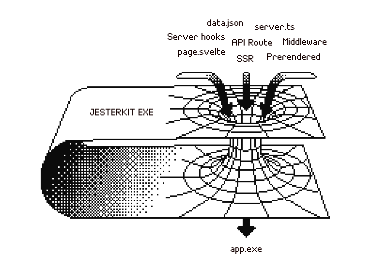
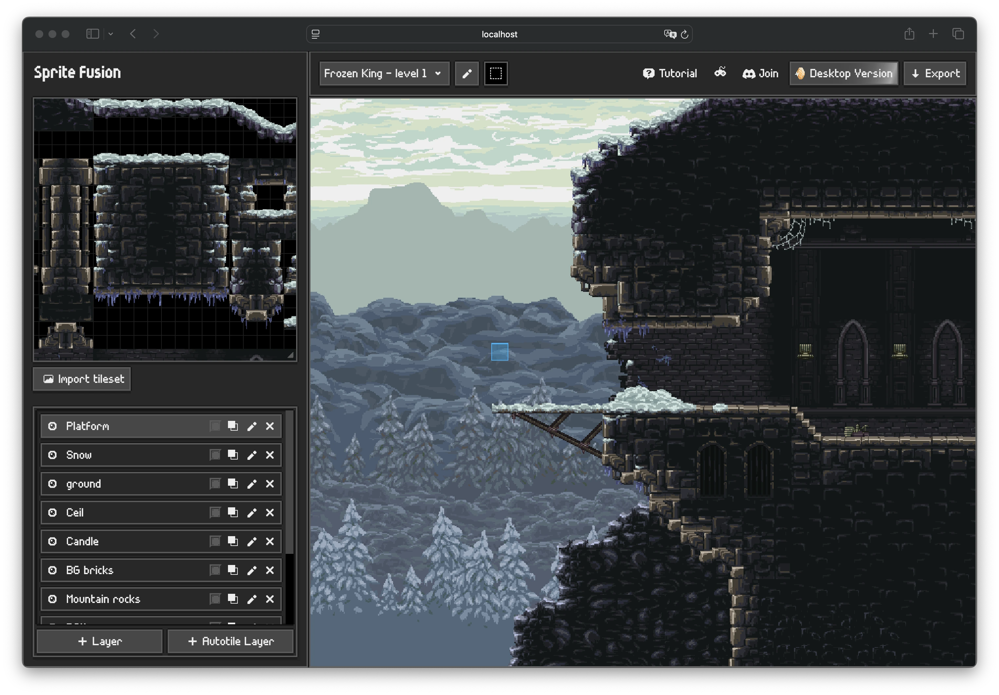

# EXE

A build tool to distribute your full-stack web app as a **single executable binary** with zero runtime dependencies.

Unlike static builds that strip away server capabilities, EXE preserves **all server-side features** of your full stack framework: SSR, API endpoints, server middleware, server-side authentication, etc.



## Why ?

**Traditional standalone software approaches lose functionality:**

- SPA builds + Rust / Go → Lose frontend framework's server features (SSR, API routes, etc.).
- Desktop apps → Can't be deployed to the web.
- Docker → Need to install Docker and spin up a container locally.

**With EXE:**

- ✅ Full-stack framework capabilities preserved, build as you would for the web.
- ✅ Single binary, no runtime dependencies.
- ✅ Cross-platform executable.
- ✅ Runs anywhere: locally, or on a small cloud machine.

## Perfect for

- **Open-source tools** users can run without Docker/Node.
- **Commercial software** sold as one-time purchase for self-hosting vs SaaS.
- **Privacy-focused apps** prioritizing local data ownership.
- **Demos** for users to try before buying.

Examples: AI chat apps, project management tools, image editors, web analytics...



<p align="center"><em>A full-stack SvelteKit web app tilemap engine compiled with EXE. Running locally.</em></p>

<br>

## Quick Start with SvelteKit

> [Nuxt](./packages/nuxt) and [TanStack](./packages/tanstack) are also supported but experimental.

Requires [Bun](https://bun.com/) installed on your machine to build the executable (not to run).

```bash
npm install @jesterkit/exe-sveltekit
```

```js
// svelte.config.js
import adapter from "@jesterkit/exe-sveltekit";

export default {
	kit: {
		adapter: adapter({
			binaryName: "my-app",
		}),
	},
};
```

```bash
npm run build
./dist/my-app
```

Your app runs at `http://localhost:3000` with **full server capabilities of SvelteKit**. Check the README of the [SvelteKit adapter](./packages/sveltekit/README.md) for more details.

🎁 **Bonus**: If you select the `linux-x64` target, a Dockerfile is automatically generated so you can self-host your software in one command using the Fly.io [CLI](https://fly.io/docs/flyctl/):

```bash
fly launch
```

## License

MIT License [Hugo Duprez](https://www.hugoduprez.com/)
